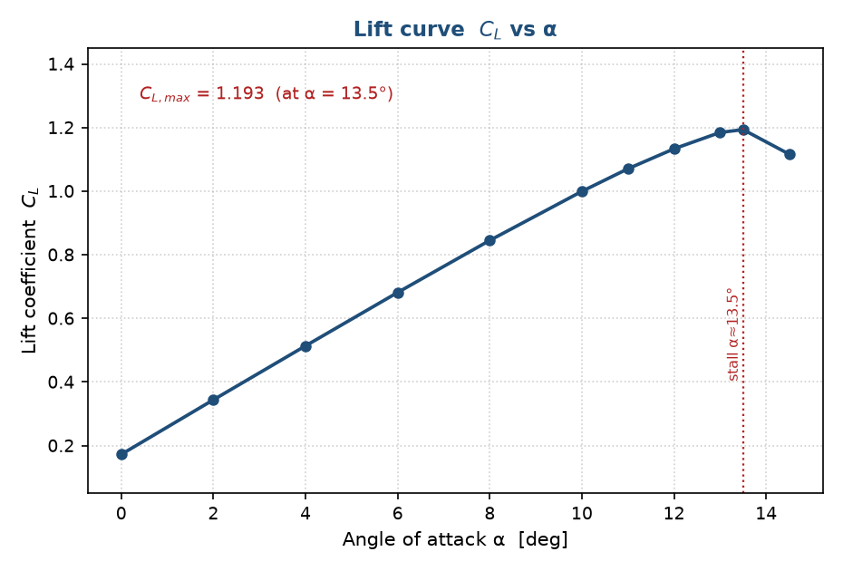
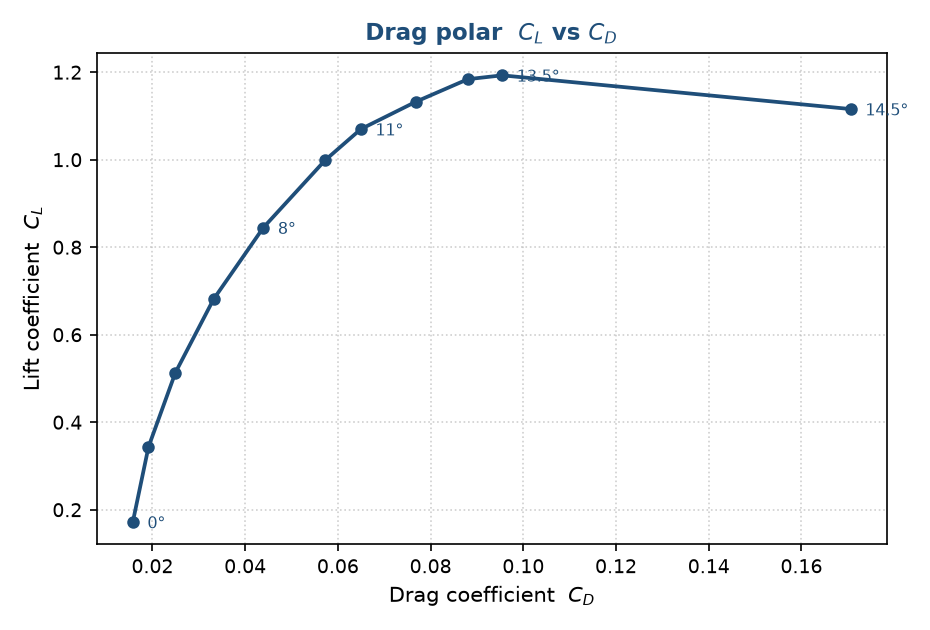
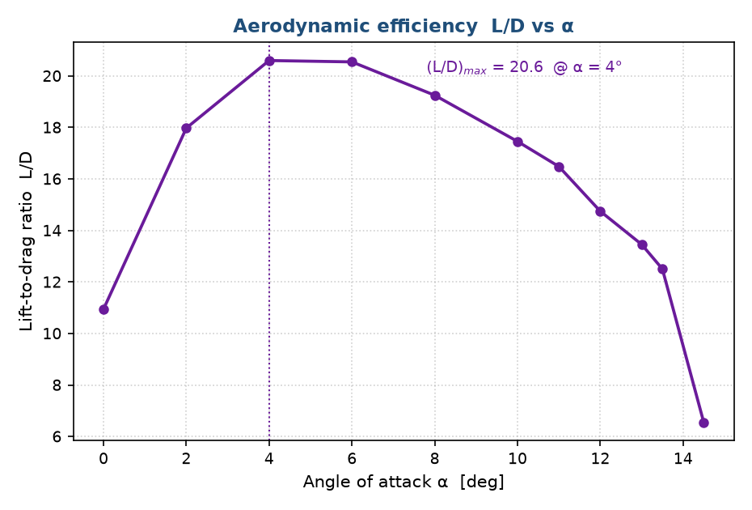
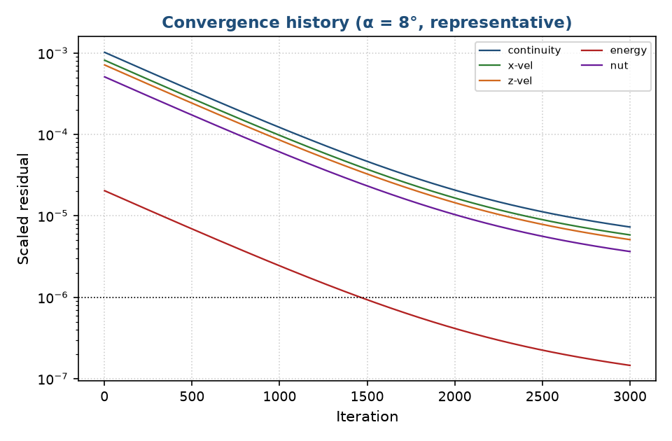

<div align="center">

# Aero CFD Case Study — CRM-HL Wing-Body

### RANS aerodynamic characterisation of the NASA High-Lift Common Research Model, implemented as a fully scripted PyAnsys pipeline

[](https://www.python.org/)
[](https://www.ansys.com/products/fluids/ansys-fluent)
[](https://fluent.docs.pyansys.com/)
[](#methodology)
[](LICENSE)

</div>

---

A holistic, end-to-end computational-aerodynamics case study built around the
**NASA High-Lift Common Research Model (CRM-HL) Wing-Body**, synthesising six
source CFD investigations into a single, reproducible **PyAnsys** workflow for a
local ANSYS Fluent installation.

The unifying problem is the RANS prediction of the aerodynamic **force system
versus angle of attack** (C_L, C_D, C_M, L/D). The pipeline sweeps
α = 0°–14.5° and reproduces a critical (stall) angle of ≈ 13.5° with
C_L,max ≈ 1.193.

---

## Table of contents

- [Results at a glance](#results-at-a-glance)
- [Key results](#key-results)
- [Methodology](#methodology)
- [Deliverable](#deliverable)
- [Repository structure](#repository-structure)
- [Requirements](#requirements)
- [How to run](#how-to-run)
- [Source studies](#source-studies)
- [Notes & assumptions](#notes--assumptions)
- [License](#license)

---

## Results at a glance

| Quantity | Value | Notes |
|---|---|---|
| Configuration | CRM-HL Wing-Body | NASA High-Lift Common Research Model |
| Freestream Mach | M∞ = 0.20 | Subsonic high-lift regime |
| Reynolds number | Re ≈ 5.6 × 10⁶ | Chord-based |
| Turbulence model | Spalart–Allmaras | RANS |
| AoA sweep | α = 0° → 14.5° | Full force system |
| Maximum lift | C_L,max ≈ 1.193 | |
| Stall angle | α_stall ≈ 13.5° | Critical angle of attack |
| Lift-curve slope (live 2.5-D) | C_lα ≈ 0.103 / deg | Matches thin-aerofoil theory |

---

## Key results

<div align="center">

| Lift curve — C_L vs α | Drag polar — C_L vs C_D |
|:---:|:---:|
|  |  |
| **Aerodynamic efficiency — L/D vs α** | **Solver convergence** |
|  |  |

</div>

> Additional charts, field contours and the dimensioned drawing set are available in [`figures/`](figures/).

---

## Methodology

The study is delivered as a **5-stage PyAnsys pipeline**, chained by a single master runner:

| Stage | Module | Purpose |
|:--:|---|---|
| 0 | `crm_hl_geometry.py` | Geometry, reference quantities, y⁺ sizing, STL/CAD preparation |
| 1 | `crm_hl_mesh.py` | Fluent Meshing (watertight / fault-tolerant workflow) |
| 2 | `crm_hl_setup.py` | Models, materials, boundary conditions, reference values |
| 3 | `crm_hl_solve.py` | Angle-of-attack sweep with convergence monitors |
| 4 | `crm_hl_post.py` | Contours, drag polar, validation |

A boundary-layer-resolved **2.5-D section sweep** (y⁺ ≈ 1, ~70 k cells) was additionally
executed locally on **ANSYS Student 2025 R2** as a live validation; the resulting lift-curve
slope C_lα ≈ 0.103/deg matches thin-aerofoil theory.

---

## Deliverable

| File | Description |
|------|-------------|
| [`aero_project_report.pdf`](aero_project_report.pdf) | Full project report — literature synthesis, geometry and reference quantities, the force system, holistic input data, the 5-stage PyAnsys workflow, primary results, and the complete collation of output data from the source studies. |

---

## Repository structure

```
aero-project-sam/
├─ README.md
├─ LICENSE
├─ aero_project_report.pdf   # full project report (primary deliverable)
├─ pipeline/                 # PyAnsys CFD pipeline (5 ANSYS stages + master runner)
│   ├─ crm_hl_geometry.py    #   Stage 0  Geometry
│   ├─ crm_hl_mesh.py        #   Stage 1  Mesh
│   ├─ crm_hl_setup.py       #   Stage 2  Setup
│   ├─ crm_hl_solve.py       #   Stage 3  Solution
│   ├─ crm_hl_post.py        #   Stage 4  Post-processing
│   ├─ run_crm_hl.py         #   master runner — chains stages 0 → 4
│   ├─ gen_clean_geom.py     #   single watertight wing solid for the live demo
│   ├─ local_mesh_2p5d.py    #   gmsh boundary-layer mesh for the 2.5-D section -> CGNS
│   └─ local_solve_2p5d.py   #   local Fluent RANS sweep -> out/polar_live.csv
├─ geometry/                 # geometry inputs and generated STL solids
├─ mesh/                     # generated meshes (CGNS)
├─ out/                      # solver outputs (polar CSV files)
└─ figures/                  # drawings, result charts and field previews
```

---

## Requirements

- **Python 3.13**, with:

  ```bash
  pip install ansys-fluent-core numpy matplotlib
  ```

- A local **ANSYS Fluent + Fluent Meshing** for pipeline stages 1–4 (verified on 2025 R2).
- Stage 0 (geometry) runs with NumPy alone — no ANSYS required.

---

## How to run

**Full CFD pipeline** (requires local ANSYS):

```bash
cd pipeline
python run_crm_hl.py                  # full pipeline using the generated STL geometry
python run_crm_hl.py --cad crm.pmdb   # use the official watertight HLPW CAD (recommended)
python run_crm_hl.py --post-only      # rebuild charts from out/polar.csv
python run_crm_hl.py --export-fields  # export contours/pathlines at α = 0, 8, 13.5°
```

**Live 2.5-D section sweep** (as executed locally on ANSYS Student 2025 R2):

```bash
cd pipeline
python local_mesh_2p5d.py     # gmsh boundary-layer mesh -> CGNS (no ANSYS needed)
python local_solve_2p5d.py    # Fluent RANS sweep -> out/polar_live.csv
```

---

## Source studies

**Directly relevant — inform the case:**

1. Amaya (2025) — HLPW-5 Case 1, CRM-HL-WB (Uniandes thesis) — *primary geometry & dataset*
2. Zore et al. (2018) — ANSYS high-lift configurations, HL-CRM & JSM (AIAA 2018-2844)
3. Hiremath & Malipatil (2014) — Aircraft body vs AoA (IJIRSET)
4. Koç et al. (2024) — UAV modelling & simulation (J. Thermal Eng.)

**Reviewed but out of scope** (different flow regimes, not used):

- Steelant et al. (2015) — ATLLAS II Mach-5–6 hypersonic transport (EU FP7)
- Krishnan (2021) — Fluid-Thermal-Structural-Interaction seminar (ANSYS/NASA Ames)

---

## Notes & assumptions

- **Scope:** a subsonic (M∞ = 0.20) high-lift wing-body angle-of-attack study. The two
  hypersonic / multiphysics documents above were reviewed but excluded as out of regime.
- The quantitative results in the report are the collated, workshop-grade dataset reproduced
  from the relevant studies (primary AoA table = HLPW-5 5v-grid result). To generate **fresh**
  numbers, supply a mesh/CAD and run the pipeline against a local ANSYS install.
- **Live execution:** the full 3-D CRM-HL case exceeds the ANSYS Student 512 k-cell cap, so the
  locally executed case is the 2.5-D section. The section mesh is generated with gmsh and bridged
  to Fluent via CGNS, because Fluent Meshing's CAD-only region detection does not build a volume
  region from faceted STL on this build.

---

## License

Copyright © 2026 **Samuel Akosa Onyejekwe**. **All Rights Reserved.**

This repository is made publicly viewable for reference and demonstration only.
No use, copying, modification, or distribution is permitted without the Author's
prior written permission. See [`LICENSE`](LICENSE) for the full terms.
